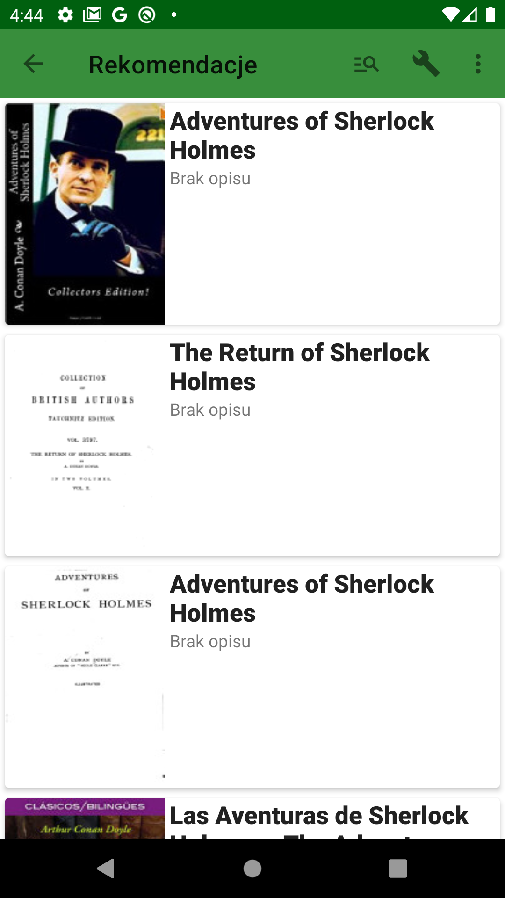

# BookStoreApp
An Android application that works with Google Books Api to manage user's book lists.

## Table of contents

* [General info](#general-info)
* [Screenshots](#screenshots)

## General info
The application allows the user to browse the books on the shelves of his choice in Google Books, as well as search for new items. Data for all books is stored in a local database, while information such as reviews and quotes are generated when selecting a specific copy and then saved in the Firebase Realtime Database.
## Screenshots

  
   
  
  
  
  
  

